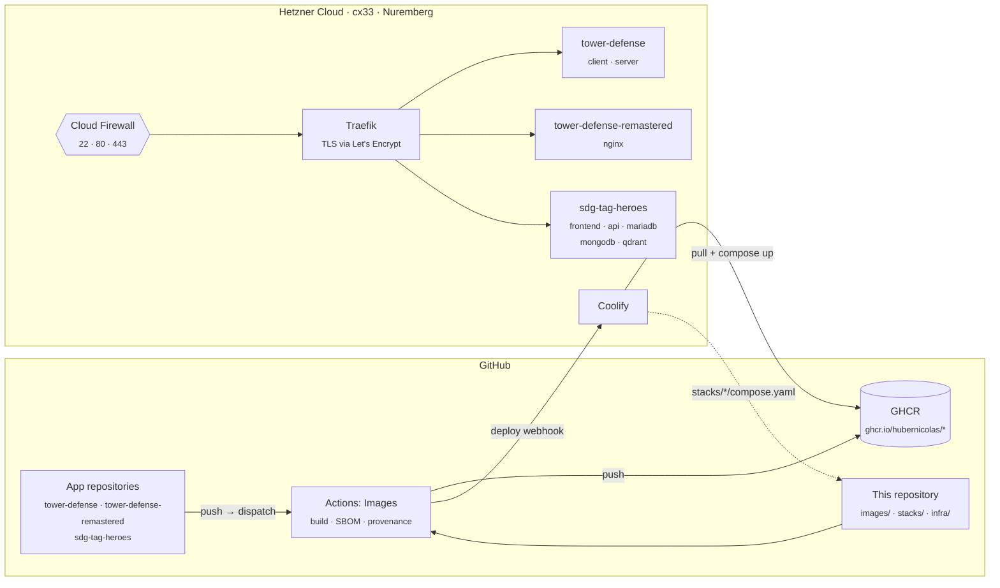

<div align="center">

# Infrastructure

**Hosting for my university projects: one Hetzner server, Coolify, and images built in GitHub Actions.**


[Concept](#concept) · [Costs](#costs) · [Setup](#setup) · [Operations](#operations)

</div>

| App | Project | Stack | URL |
|---|---|---|---|
| **Tower Defense** | Software Engineering Lab (SoPra FS21), UZH, 2021 | Spring Boot 2 · Java 15 · H2 · React | `tower-defense.<domain>` |
| **Tower Defense Remastered** | The same game, rewritten in 2026 | Vite · React 19 · TypeScript (static) | `towers.<domain>` |
| **SDG Tag Heroes** | Master's thesis, UZH | Nuxt 3 · FastAPI · PyTorch · MariaDB · MongoDB · Qdrant | `sdg-tag-heroes.<domain>` |

## Concept



**One server, one control plane.** Three small, low-traffic apps do not need Kubernetes or a managed database. A
single Hetzner VM with [Coolify](https://coolify.io) gives git-driven deployments, automatic HTTPS, per-app
environment variables and logs, and costs a few euros a month. Moving an app elsewhere later is easy, because every
app is a plain Docker Compose file.

**Build in CI, not on the server.** GitHub Actions builds every image from its source repository and pushes it to
GHCR, tagged with the source commit (`sha-1a2b3c4`) and `latest`. The server only pulls. This keeps build load (the
Nuxt build alone needs 4 GB of heap) off the machine that runs three databases, makes deployments fast, and turns
rollbacks into changing one tag. Images get an SBOM and a signed build provenance attestation.

**The app repositories stay untouched.** They are archived study projects. Production Dockerfiles that the
repositories lack (the SDG Tag Heroes API, Tower Defense Remastered) live in [`images/`](images); the ones that exist
are used as they are. [`images/catalog.json`](images/catalog.json) maps every image to its repository, context and
Dockerfile.

**Infrastructure as code.** [OpenTofu](https://opentofu.org) creates the server, SSH key and firewall;
[cloud-init](infra/cloud-init.yaml) hardens SSH, adds swap and automatic security updates, and installs Coolify.
Recreating the whole setup takes one `tofu apply` plus the Coolify clicks below.

**Private by default.** Only ports 22, 80 and 443 are open (SSH optionally limited to your IP). The databases have no
published ports and are reachable only inside their stack network. Secrets are generated by Coolify
(`SERVICE_PASSWORD_*`) and never stored in git or baked into images.

### What deliberately is not here

| Not used | Why |
|---|---|
| Kubernetes, Nomad | One server, three apps: the operational cost would dwarf the apps |
| Managed databases | Hetzner has none; elsewhere they would cost more than the server |
| Separate staging | Archived projects without active development; roll back by tag instead |
| Remote OpenTofu state | One person, one server; the S3 backend on Hetzner Object Storage is prepared in a comment |

## Costs

Approximate Hetzner prices (EUR, excl. VAT); check [hetzner.com/cloud](https://www.hetzner.com/cloud) for the current
ones.

| Item | Per month |
|---|---|
| Server `cx33`: 4 vCPU, 8 GB RAM, 80 GB SSD, 20 TB traffic | ≈ 6.50 |
| Primary IPv4 | ≈ 0.50 |
| Backups (daily, 7 kept; +20 %) | ≈ 1.30 |
| GitHub Actions, GHCR | 0 (public repositories) |
| **Total** | **≈ 8–9** plus the domain (≈ 1 per month) |

Memory budget on the 8 GB server (limits in the compose files):

| Consumer | Limit |
|---|---|
| Coolify (dashboard, Postgres, Redis, realtime) and Traefik | ≈ 1.5 GB |
| SDG Tag Heroes: API (PyTorch, sentence-transformers) | 3 GB |
| SDG Tag Heroes: MariaDB · MongoDB · Qdrant · frontend | 0.75 · 1 · 1 · 0.25 GB |
| Tower Defense: server (JVM) · client | 0.5 GB · 64 MB |
| Tower Defense Remastered | 32 MB |

The limits are ceilings, not reservations; the real use is lower, and 4 GB of swap absorbs peaks. If the thesis API
needs more, change `server_type` to `cx43` (16 GB, ≈ 11 €) and run `tofu apply`: Hetzner resizes in place with a
reboot.

## Repository structure

| Path | Content |
|---|---|
| [`infra/`](infra) | OpenTofu: server, firewall, SSH key; [`cloud-init.yaml`](infra/cloud-init.yaml) for the first boot |
| [`stacks/`](stacks) | One Docker Compose file per app, deployed by Coolify |
| [`images/`](images) | [`catalog.json`](images/catalog.json) of all images, and the Dockerfiles the app repositories lack |
| [`.github/workflows/images.yml`](.github/workflows/images.yml) | Build, push and deploy |
| [`.github/workflows/validate.yml`](.github/workflows/validate.yml) | `tofu validate`, `docker compose config`, hadolint |
| [`docs/`](docs) | [Loading the SDG Tag Heroes data](docs/sdg-tag-heroes-data.md) |

## Setup

### Prerequisites

- [OpenTofu](https://opentofu.org/docs/intro/install/) 1.8 or newer: `brew install opentofu`
- A Hetzner Cloud project and an API token (read/write)
- A domain whose DNS you control
- The app repositories on GitHub: `tower-defense`, `tower-defense-remastered`, `sdg-tag-heroes`

### 1. Create the server

```bash
cd infra
```

```bash
cp terraform.tfvars.example terraform.tfvars
```

Fill in the token and your IP, then:

```bash
tofu init
```

```bash
tofu apply
```

Coolify installs in the background for about five minutes. Follow it with:

```bash
ssh root@$(tofu output -raw ipv4) 'tail -f /var/log/cloud-init-output.log'
```

### 2. DNS

One wildcard record covers all apps and the Coolify dashboard (values from `tofu output`):

| Name | Type | Value |
|---|---|---|
| `*.<domain>` | A | `ipv4` |
| `*.<domain>` | AAAA | `ipv6` |

### 3. Coolify

1. Open `tofu output -raw coolify_setup_url` **right away** and create the admin account (the first visitor becomes
   admin).
2. Settings → Instance's domain: `https://coolify.<domain>`. Then set `coolify_setup_port_open = false` in
   `terraform.tfvars` and run `tofu apply` to close port 8000.
3. Keys & Tokens → API tokens: create a token with the `deploy` permission.
4. Sources: add this repository as a GitHub App (or a public repository if it is public).

### 4. GitHub (this repository)

| Kind | Name | Value |
|---|---|---|
| Variable | `DOMAIN` | `<domain>`, baked into the Tower Defense client |
| Variable | `COOLIFY_URL` | `https://coolify.<domain>` |
| Secret | `COOLIFY_TOKEN` | The Coolify API token |
| Secret | `SOURCE_REPOS_TOKEN` | Only while app repositories are private: fine-grained token, *Contents: read* on them |

Run **Actions → Images → Run workflow** with `all`. After the first push, make the three GHCR packages public
(Package settings → Change visibility), or log the server in to GHCR with a read-only token.

### 5. One resource per stack

In Coolify: Project → New resource → *Docker Compose* from this repository, branch `main`, and:

| Stack | Compose file | Domains (service → URL) | Tag |
|---|---|---|---|
| Tower Defense | `/stacks/tower-defense/compose.yaml` | client → `https://tower-defense.<domain>`, server → `https://tower-defense-api.<domain>` | `tower-defense` |
| Tower Defense Remastered | `/stacks/tower-defense-remastered/compose.yaml` | game → `https://towers.<domain>` | `tower-defense-remastered` |
| SDG Tag Heroes | `/stacks/sdg-tag-heroes/compose.yaml` | frontend → `https://sdg-tag-heroes.<domain>`, api → `https://sdg-tag-heroes-api.<domain>` | `sdg-tag-heroes` |

The **tag** matters: the Images workflow deploys by tag. Set the environment variables of SDG Tag Heroes from
[`stacks/sdg-tag-heroes/.env.example`](stacks/sdg-tag-heroes/.env.example), deploy, then
[load its data](docs/sdg-tag-heroes-data.md).

### 6. Deploy on push in the app repositories (optional)

A workflow in an app repository asks this repository to build and deploy. It needs a secret `INFRA_DISPATCH_TOKEN`
(fine-grained token, *Contents: read and write* on this repository only):

```yaml
# .github/workflows/deploy.yml in e.g. sdg-tag-heroes
name: Deploy
on:
  push:
    branches: [main]
jobs:
  dispatch:
    runs-on: ubuntu-latest
    steps:
      - run: gh api repos/HuberNicolas/infrastructure/dispatches -f event_type=build -f "client_payload[image]=sdg-tag-heroes"
        env:
          GH_TOKEN: ${{ secrets.INFRA_DISPATCH_TOKEN }}
```

`image` is an image name (`sdg-tag-heroes-api`) or a stack name (`sdg-tag-heroes`, builds all its images).

## Operations

| Task | How |
|---|---|
| Deploy a new version | Push to the app repository (with step 6), or run the Images workflow |
| Roll back | Coolify → resource → Environment: `IMAGE_TAG=sha-<commit>`, redeploy |
| Logs, shell, restart | Coolify → resource → service |
| Database access | `docker exec` on the server, see [docs](docs/sdg-tag-heroes-data.md); nothing is exposed publicly |
| Backups | Hetzner daily server backups (7 days); logical dumps: [docs](docs/sdg-tag-heroes-data.md#backups) |
| OS updates | Security updates install automatically; `apt upgrade` and a reboot now and then |
| Coolify updates | Coolify → Settings → Update (or auto-update) |
| Base images | Dependabot opens monthly pull requests for actions, providers and images |
| Scale up | `server_type` in `terraform.tfvars`, `tofu apply` |

## Known limitations

- **Tower Defense runs Java 15 and Node 14**, both end of life. They are kept on purpose: the 2021 code does not build
  with newer versions. The game state is an in-memory H2 database and resets on every deployment.
- **The Tower Defense client has its API address baked in** (Create React App), so the server must be at
  `tower-defense-api.<DOMAIN>`, and changing the domain means rebuilding the image.
- **The SDG Tag Heroes API image is large (several GB)**: `torch==2.1.1` from PyPI brings CUDA libraries the CPU
  server never uses. A CPU-only torch build would cut that, but it changes the thesis lockfile.
- **Single server, no high availability.** A Hetzner outage takes all apps down until it is back or restored from a
  backup; for portfolio projects that is the right trade-off.

## Author

**Nicolas Huber**
