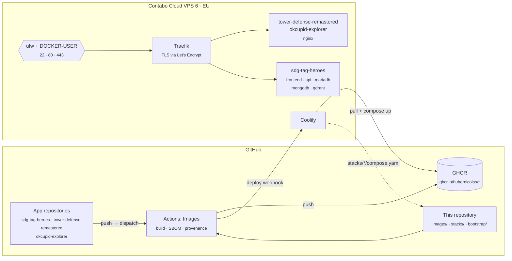

<div align="center">

# Infrastructure

**Hosting for my university projects: one Contabo server, Coolify, and images built in GitHub Actions.**


[Concept](#concept) · [Costs](#costs) · [Setup](#setup) · [Operations](#operations)

</div>

| App | Project | Stack | URL |
|---|---|---|---|
| **SDG Tag Heroes** | Master's thesis, UZH (branch `redesign/dark-light-theme`) | Nuxt 3 · FastAPI · PyTorch · MariaDB · MongoDB · Qdrant | `sdg-tag-heroes.<domain>` |
| **Tower Defense Remastered** | The 2021 game, rewritten in 2026 | Vite · React 19 · TypeScript (static) | `towers.<domain>` |
| **OkCupid Explorer** | Group project, UZH, 2022, rebuilt in 2026 | Vite · Vue 3 · ECharts (static) | `okcupid-explorer.<domain>` |

Also on the server, not public: [Hermes Agent](https://github.com/NousResearch/hermes-agent), a personal AI agent
reached through Telegram, contained to its own container and the internet ([concept and security model](docs/hermes-agent.md)).


## Concept


```mermaid
flowchart LR
    subgraph github[GitHub]
        src["App repositories<br/><sub>sdg-tag-heroes · tower-defense-remastered<br/>okcupid-explorer</sub>"]
        infra["This repository<br/><sub>images/ · stacks/ · bootstrap/</sub>"]
        actions["Actions: Images<br/><sub>build · SBOM · provenance</sub>"]
        ghcr[("GHCR<br/><sub>ghcr.io/hubernicolas/*</sub>")]
    end

    subgraph server["Contabo Cloud VPS 6 · EU"]
        fw{{"ufw + DOCKER-USER<br/><sub>22 · 80 · 443</sub>"}}
        traefik["Traefik<br/><sub>TLS via Let's Encrypt</sub>"]
        coolify["Coolify"]
        tdr["tower-defense-remastered<br/>okcupid-explorer<br/><sub>nginx</sub>"]
        sdg["sdg-tag-heroes<br/><sub>frontend · api · mariadb<br/>mongodb · qdrant</sub>"]
    end

    src -- "push → dispatch" --> actions
    infra --> actions
    actions -- push --> ghcr
    actions -- "deploy webhook" --> coolify
    coolify -- "pull + compose up" --> ghcr
    coolify -. "stacks/*/compose.yaml" .-> infra
    fw --> traefik --> tdr & sdg
```

**One server, one control plane.** Three small, low-traffic apps do not need Kubernetes or a managed database. A
single VPS with [Coolify](https://coolify.io) gives git-driven deployments, automatic HTTPS, per-app
environment variables and logs, and costs a few euros a month. Moving an app elsewhere later is easy, because every
app is a plain Docker Compose file.

**Build in CI, not on the server.** GitHub Actions builds every image from its source repository and pushes it to
GHCR, tagged with the source commit (`sha-1a2b3c4`) and `latest`. The server only pulls. This keeps build load (the
Nuxt build alone needs 4 GB of heap) off the machine that runs three databases, makes deployments fast, and turns
rollbacks into changing one tag. Images get an SBOM and a signed build provenance attestation.

**The app repositories stay untouched.** They are archived study projects. Production Dockerfiles that the
repositories lack live in [`images/`](images): the SDG Tag Heroes API, and one shared image for static Vite apps
(Tower Defense Remastered, OkCupid Explorer). The ones that exist are used as they are. [`images/catalog.json`](images/catalog.json) maps every image to its repository, context and
Dockerfile.

**Reproducible server setup.** The server is ordered once in the Contabo panel. Everything after that is one
idempotent script, [`bootstrap/setup.sh`](bootstrap/setup.sh): updates, key-only SSH, firewall, swap, automatic
security updates, fail2ban and Coolify. Moving to another provider means ordering an Ubuntu server there and running
the same script; the stacks and images do not change.

**Private by default.** Only ports 22, 80 and 443 are open (SSH optionally limited to your IP). Docker publishes
container ports past `ufw`, so the script also blocks the Coolify ports (8000, 6001, 6002) in Docker's `DOCKER-USER`
chain; the dashboard is reached through an SSH tunnel until it has its own domain. The databases have no published
ports and are reachable only inside their stack network. Containers labelled `infrastructure.egress=internet-only`
(Hermes Agent) are limited to the internet: the same script keeps them away from the server itself and from every
private network. Secrets are generated by Coolify
(`SERVICE_PASSWORD_*`) and never stored in git or baked into images.

### What deliberately is not here

| Not used | Why |
|---|---|
| Kubernetes, Nomad | One server, three apps: the operational cost would dwarf the apps |
| Managed databases | They would cost several times the server |
| Separate staging | Archived projects without active development; roll back by tag instead |
| Terraform / OpenTofu | One long-lived server, ordered once; a provisioning tool would manage a single resource |
| Hyperscalers (AWS, DigitalOcean, Scaleway) | Three to five times the price for the same RAM |

## Costs

RAM decides the server size: PyTorch, three databases and Coolify need memory, not CPU.

| Item | Per month |
|---|---|
| Contabo Cloud VPS 6: 6 vCPU, 12 GB RAM, 100 GB NVMe, 2 snapshots, EU location | ≈ 8.50 € |
| GitHub Actions, GHCR | 0 (public repositories) |
| **Total** | **≈ 8.50 €** plus the domain (≈ 1 € per month) |

Compared in October 2026 at 8 GB RAM or more: OVHcloud VPS-2 (8 GB, ≈ 10 €), netcup VPS 1000 (8 GB, ≈ 17 €),
Scaleway (≈ 25 €), DigitalOcean (≈ 48 $); Hetzner Cloud was not orderable. Contabo gives the most RAM per euro; the
trade-off is shared CPUs that can vary in speed, which an app with little traffic barely notices.

Memory budget on the 12 GB server (limits in the compose files):

| Consumer | Limit |
|---|---|
| Coolify (dashboard, Postgres, Redis, realtime) and Traefik | ≈ 1.5 GB |
| SDG Tag Heroes: API (PyTorch, sentence-transformers) | 4 GB |
| SDG Tag Heroes: MariaDB · MongoDB · Qdrant · frontend | 1 · 2 · 1.5 · 0.25 GB |
| Tower Defense Remastered · OkCupid Explorer | 32 MB each |
| Hermes Agent (the model runs at the provider) | 2 GB |

The limits are ceilings, not reservations; the real use is lower, and 4 GB of swap absorbs peaks.

## Repository structure

| Path | Content |
|---|---|
| [`bootstrap/setup.sh`](bootstrap/setup.sh) | Turns a fresh Ubuntu 24.04 server into a Coolify host, with firewall and egress guard |
| [`stacks/`](stacks) | One Docker Compose file per app, deployed by Coolify |
| [`images/`](images) | [`catalog.json`](images/catalog.json) of all images, and the Dockerfiles the app repositories lack |
| [`.github/workflows/images.yml`](.github/workflows/images.yml) | Build, push and deploy |
| [`.github/workflows/validate.yml`](.github/workflows/validate.yml) | shellcheck, `docker compose config`, hadolint |
| [`docs/`](docs) | [Deploying an app](docs/deploying-an-app.md) · [Hermes Agent](docs/hermes-agent.md) · [Hermes ideas](docs/hermes-ideas.md) · [Loading the SDG Tag Heroes data](docs/sdg-tag-heroes-data.md) |

## Setup

### Prerequisites

- A VPS with Ubuntu 24.04 and at least 8 GB RAM (here: Contabo Cloud VPS 6, EU location, NVMe storage, no control
  panel)
- A domain whose DNS you control
- The app repositories on GitHub: `sdg-tag-heroes`, `tower-defense-remastered`, `okcupid-explorer`

### 1. Prepare the server

Copy your SSH key to the server (asks once for the root password from the provider's e-mail):

```bash
ssh-copy-id root@<server-ip>
```

Run the bootstrap script. It refuses to run without a key, because it switches SSH to key-only login:

```bash
ssh root@<server-ip> 'bash -s' < bootstrap/setup.sh
```

To allow SSH only from your network, prefix it with `ADMIN_CIDR=<your-ip>/32` inside the quotes. If the provider
offers a firewall in its panel, allow the same ports there (22, 80, 443 TCP and 443 UDP) as a second layer.

### 2. DNS

One wildcard record covers all apps and the Coolify dashboard:

| Name | Type | Value |
|---|---|---|
| `*.<domain>` | A | server IPv4 |
| `*.<domain>` | AAAA | server IPv6 (if the server has one) |

### 3. Coolify

1. Open a tunnel and visit <http://localhost:8000> **right away** to create the admin account (the first visitor
   becomes admin):

   ```bash
   ssh -N -L 8000:localhost:8000 -L 6001:localhost:6001 -L 6002:localhost:6002 root@<server-ip>
   ```

2. Settings → Instance's domain: `https://coolify.<domain>`. From then on the dashboard runs over HTTPS and the
   tunnel is no longer needed.
3. Keys & Tokens → API tokens: create a token with the `deploy` permission.
4. Sources: add this repository as a GitHub App (or a public repository if it is public).

### 4. GitHub (this repository)

| Kind | Name | Value |
|---|---|---|
| Variable | `COOLIFY_URL` | `https://coolify.<domain>` |
| Secret | `COOLIFY_TOKEN` | The Coolify API token |
| Secret | `SOURCE_REPOS_TOKEN` | Only while app repositories are private: fine-grained token, *Contents: read* on them |

Run **Actions → Images → Run workflow** with `all`. Packages built from this public repository are public, so the
server pulls them without a login.

### 5. One resource per stack

In Coolify: Project → New resource → *Docker Compose* from this repository, branch `main`, and the values below. The
step by step guide, including the pitfalls (domain fields, saving variables, deploying before the image exists), is
[Deploying an app](docs/deploying-an-app.md).

| Stack | Compose file | Domains (service → URL) | Tag |
|---|---|---|---|
| SDG Tag Heroes | `/stacks/sdg-tag-heroes/compose.yaml` | frontend → `https://sdg-tag-heroes.<domain>`, api → `https://sdg-tag-heroes-api.<domain>` | `sdg-tag-heroes` |
| Tower Defense Remastered | `/stacks/tower-defense-remastered/compose.yaml` | game → `https://towers.<domain>` | `tower-defense-remastered` |
| OkCupid Explorer | `/stacks/okcupid-explorer/compose.yaml` | app → `https://okcupid-explorer.<domain>` | `okcupid-explorer` |
| Hermes Agent | `/stacks/hermes-agent/compose.yaml` | none | `hermes-agent` |

Ports for the domains: 8080 for the static apps, 3000 for the frontend, 8001 for the API. Hermes Agent needs a one-time setup after its first deployment: [docs/hermes-agent.md](docs/hermes-agent.md#setup). Set the environment variables of SDG Tag Heroes from
[`stacks/sdg-tag-heroes/.env.example`](stacks/sdg-tag-heroes/.env.example), deploy, then
[load its data](docs/sdg-tag-heroes-data.md).

### 6. Deploy on push in the app repositories (optional)

A workflow in an app repository asks this repository to build and deploy. It needs a secret `INFRA_DISPATCH_TOKEN`
(fine-grained token, *Contents: read and write* on this repository only):

```yaml
# .github/workflows/deploy.yml in e.g. sdg-tag-heroes
name: Deploy
on:
  push:
    branches: [main]
jobs:
  dispatch:
    runs-on: ubuntu-latest
    steps:
      - run: gh api repos/HuberNicolas/infrastructure/dispatches -f event_type=build -f "client_payload[image]=sdg-tag-heroes"
        env:
          GH_TOKEN: ${{ secrets.INFRA_DISPATCH_TOKEN }}
```

`image` is an image name (`sdg-tag-heroes-api`) or a stack name (`sdg-tag-heroes`, builds all its images).

## Operations

| Task | How |
|---|---|
| Add an app | [Deploying an app](docs/deploying-an-app.md) |
| Deploy a new version | Push to the app repository (with step 6), or run the Images workflow |
| Roll back | Coolify → resource → Environment: `IMAGE_TAG=sha-<commit>`, redeploy |
| Logs, shell, restart | Coolify → resource → service |
| Database access | `docker exec` on the server, see [docs](docs/sdg-tag-heroes-data.md); nothing is exposed publicly |
| Backups | Contabo snapshots before risky changes (2 included); logical dumps: [docs](docs/sdg-tag-heroes-data.md#backups) |
| OS updates | Security updates install automatically; `apt upgrade` and a reboot now and then |
| Coolify updates | Coolify → Settings → Update (or auto-update) |
| Base images | Dependabot opens monthly pull requests for actions and images |
| Server changes | Edit [`bootstrap/setup.sh`](bootstrap/setup.sh) and run it again; it only changes what differs |
| Scale up | Upgrade the plan in the provider panel, or move: new server, step 1, restore the data |

## Known limitations

- **The SDG Tag Heroes API needs PyTorch** for its embeddings (similarity search, user coordinates on the map). The
  image installs the CPU build of the same version (`torch==2.1.1+cpu`) instead of the PyPI wheel with its 2 GB of
  CUDA libraries, which cuts the image from about 3 GB to under 1 GB compressed; the thesis lockfile stays unchanged.
- **Single server, no high availability.** An outage takes all apps down until the server is back or restored; for
  portfolio projects that is the right trade-off.
- **No automatic off-server backups yet.** Contabo snapshots live on the same host. For the thesis data, copy the
  logical dumps off the server, or add an S3 target to Coolify's scheduled backups.

## Author

**Nicolas Huber**
