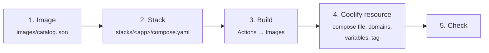

# Deploying an app

How to bring a new app onto the server, from its repository to a running URL, and what to check when it does not
work. The examples use the server of this repository (`169.58.124.58`, addresses on `sslip.io`); replace them with
your own domain once there is one.



## 1. Image

Every app runs from an image on GHCR (`ghcr.io/hubernicolas/<name>`), built by GitHub Actions. Add an entry to
[`images/catalog.json`](../images/catalog.json):

```json
{
  "name": "my-app",
  "stack": "my-app",
  "repository": "HuberNicolas/my-app",
  "context": ".",
  "dockerfile": "source/Dockerfile"
}
```

| Field | Meaning |
|---|---|
| `name` | Image name: `ghcr.io/hubernicolas/<name>` |
| `stack` | The stack (and Coolify tag) the image belongs to; several images can share one stack |
| `repository` | Source repository on GitHub |
| `ref` | Optional: branch, tag or commit to build; default `main` |
| `context` | Build context inside the source repository |
| `dockerfile` | `source/…` for a Dockerfile in the app repository, `infrastructure/images/…` for one in this repository |
| `build_contexts` | Optional: extra named build contexts, e.g. a config file from this repository |

Which Dockerfile:

- **The app has a production Dockerfile:** use it (`source/<path>`).
- **A static Vite app** (`npm run build` → `dist/`): use [`images/static-site`](../images/static-site/Dockerfile) with
  `"build_contexts": "config=infrastructure/images/static-site"`. Its nginx listens on **8080**.
- **Anything else:** write a Dockerfile in `images/<name>/`, as for the SDG Tag Heroes API. Run as a non-root user,
  add a `HEALTHCHECK`, and keep build tools out of the final image.
- **An upstream image** (e.g. Hermes Agent): no catalog entry, reference the image in the stack directly and pin a
  version.

## 2. Stack

Create `stacks/<app>/compose.yaml`. Coolify deploys this file as it is. Start from an existing one, e.g.
[`okcupid-explorer`](../stacks/okcupid-explorer/compose.yaml):

```yaml
services:
  app:
    image: ghcr.io/hubernicolas/my-app:${IMAGE_TAG:-latest}
    restart: unless-stopped
    expose:
      - "8080"
    environment:
      - SERVICE_URL_APP_8080
    deploy:
      resources:
        limits:
          memory: 128M
```

| Line | Why |
|---|---|
| `${IMAGE_TAG:-latest}` | Roll back by setting `IMAGE_TAG=sha-<commit>` in Coolify |
| `expose` | The port the container listens on. Coolify reads it to route the domain; without it Coolify warns "Unrecognized internal port" |
| `SERVICE_URL_<SERVICE>_<PORT>` | Tells Coolify which service gets a public address on which port. `<SERVICE>` is the service name in capitals |
| `memory` limit | Every service gets one, so a single app cannot take the server down |
| no `ports:` | Traefik routes to the container; nothing is published on the host. Databases get no domain and stay inside the stack network |

Secrets are not written into the file. Use Coolify's generated values: `${SERVICE_PASSWORD_<NAME>}` for passwords,
`${SERVICE_BASE64_64_<NAME>}` for long random keys. Another service's public URL is `${SERVICE_URL_<SERVICE>}` (see
the SDG Tag Heroes stack, where the frontend gets the API's URL this way).

Check the file before pushing:

```bash
docker compose --env-file stacks/ci.env -f stacks/my-app/compose.yaml config --quiet
```

Commit and push. CI runs the same check.

## 3. Build the image

A push that changes `images/` (including the catalog) builds every image in the catalog. To build one image by hand,
for example after a push to the app repository:

1. GitHub → **HuberNicolas/infrastructure → Actions → Images → Run workflow**
2. Fill in:

   | Field | Value |
   |---|---|
   | **Use workflow from** | `main` (the branch of *this* repository) |
   | **image** | an image name (`my-app`), a stack name (all its images) or `all` |
   | **ref** | empty: the catalog's `ref`, else `main`. Only set it to build another branch of the app repository |

3. Wait until the run is green (a static site takes about 2 minutes, the SDG Tag Heroes API about 10).

**Deploy only after the build has finished.** Coolify pulls the image; a deployment that starts before the image
exists fails with "Image … not found".

New GHCR packages built from this public repository are public, so the server can pull them without logging in.

## 4. Coolify resource

1. **Projects → portfolio → production** (public apps) or **private → production** (tools such as Hermes Agent)
2. **+ New → Public Repository**, URL `https://github.com/HuberNicolas/infrastructure`, **Check repository**
3. **Branch** `main`, **Build Pack** *Docker Compose*, **Base Directory** `/`, **Docker Compose Location**
   `/stacks/<app>/compose.yaml`, **Continue**
4. **Domains**: Coolify lists every service that has a `SERVICE_URL_…` line. Each domain has three fields:

   | Field | Value |
   |---|---|
   | Protocol | `https` |
   | Domain | the hostname only, e.g. `my-app.169.58.124.58.sslip.io`: no `https://`, no port |
   | Port | the port from `expose` |

   **Save.** Unsaved domains are lost, and Coolify falls back to a generated address such as
   `app-<uuid>.169.58.124.58.sslip.io`.
5. **Environment Variables**: Coolify creates one entry per `${VAR:-default}` in the compose file, filled with the
   default. To change a value, edit it and click **Update in that row** (or switch to **Developer view** and click
   **Save All Environment Variables**). The Save button at the top does not save variables, and a redeploy uses only
   saved values.
6. **Tags**: the stack name (e.g. `my-app`). The Images workflow deploys by tag once Coolify is connected to GitHub
   (README, setup step 4).
7. **Deploy**

## 5. Check

```bash
curl -sI https://my-app.169.58.124.58.sslip.io/ | head -1
```

On the server, the containers and the variables they actually received:

```bash
ssh root@169.58.124.58 'docker ps --format "{{.Names}} {{.Status}}" | grep my-app'
```

```bash
ssh root@169.58.124.58 'docker inspect $(docker ps -qf name=^app-) --format "{{range .Config.Env}}{{println .}}{{end}}"'
```

## Troubleshooting

| Symptom | Cause | Fix |
|---|---|---|
| Deployment fails: "Image ghcr.io/… not found" | Deployed before the image was built | Wait for the Images run, then deploy again |
| Images run fails: `429 Too Many Requests` from Docker Hub | Anonymous pulls from shared runners | Already handled: BuildKit pulls Docker Hub images through `mirror.gcr.io` |
| "Unrecognized internal port" when setting the domain | The port is missing in `expose` | Add `expose`; the warning alone is harmless |
| "Invalid URL: https://https://…" | `https://` typed into the Domain field | Domain field: hostname only |
| 502 Bad Gateway | The domain's port is not the one the container listens on | Use the port from `expose` (8080 for the static apps) |
| App runs at `<service>-<uuid>.….sslip.io` instead of your domain | The domain was not saved | Enter it again, **Save**, redeploy |
| A changed variable has no effect after a redeploy | The variable was not saved (top Save button) | **Update** in its row, then redeploy |
| Browser: certificate warning, `curl` exit 60 | Let's Encrypt is still issuing (1–2 minutes), or its rate limit for the shared `sslip.io` domain is reached | Wait; with your own domain the limit no longer applies |
| SDG Tag Heroes map: 404 on `…/1/1000/` | `MAP_PARTITIONS` does not fit the dataset | 3 for the dummy dataset, 1000 for the thesis data |

## Updating and rolling back

| Task | How |
|---|---|
| New version of an app | Build its image (step 3), then **Redeploy** in Coolify, or let the Images workflow deploy by tag |
| Change the stack (compose file) | Push to `main`; the next deployment reads the file from the repository |
| Roll back | Coolify → Environment Variables: `IMAGE_TAG=sha-<commit>`, **Update**, redeploy |
| Data of SDG Tag Heroes | [Its own runbook](sdg-tag-heroes-data.md) |
